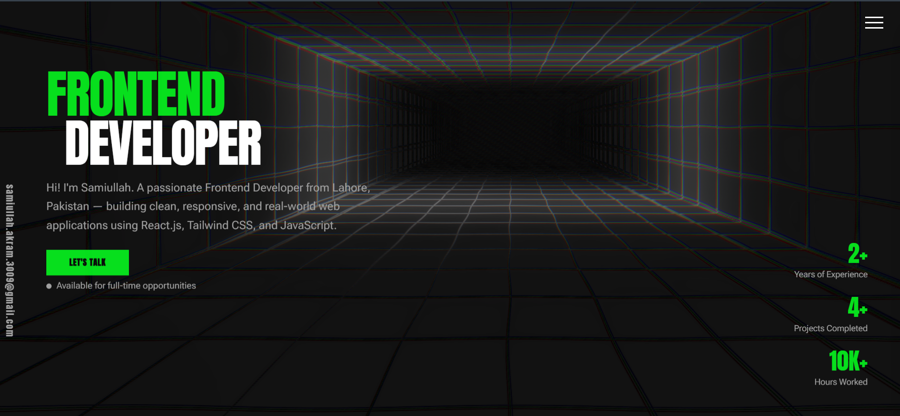

<div align="center">

# 🧑‍💻 Samiullah — Frontend Developer Portfolio

**A modern, animated portfolio built with React.js, GSAP, and Tailwind CSS.**  
Showcasing real-world projects, skills, and a passion for clean, responsive UI.

[](https://your-portfolio-url.vercel.app)
[](https://react.dev)
[](https://tailwindcss.com)
[](https://greensock.com/gsap)

</div>

---

## 📸 Preview

> *Home page with hero text, animated stats, and scroll-triggered transitions*



---

## ✨ Features

- 🎬 **Page transition curtain** — green wipe animation on every project page load
- 🖱️ **Custom Interactive Cursor** — high-performance, responsive custom pointer that reacts to clickable elements
- 🖼️ **Cursor-following image previews** — hover a project name to see a live screenshot float beside your cursor
- 📜 **Scroll-triggered animations** — elements slide in and out as you scroll using GSAP ScrollTrigger
- 🌐 **GridScan background** — interactive animated grid that reacts to mouse movement
- 📧 **Sticky email bar** — vertical email link fixed to the left on every page
- 🍔 **Slide-in nav drawer** — hamburger menu with social links and page navigation
- 📱 **Fully responsive** — mobile-first layout with desktop enhancements
- ⚡ **Preloader animation** — branded intro before the main content loads
- 🧩 **Multi-page SPA** — React Router with dedicated pages for each project

---

## 🚀 Live Demo

**[→ View Portfolio](https://your-portfolio-url.vercel.app)**

---

## 🗂️ Project Structure

```text
Portfolio/
│
├── public/
│   └── favicon.svg
│
├── src/
│   ├── assets/
│   │   └── components/
│   │       └── Preloader.jsx          # Intro loading animation
│   │
│   ├── components/
│   │   ├── Home.jsx                   # Hero section with stats
│   │   ├── Aboutme.jsx                # About me section
│   │   ├── MyStack.jsx                # Tech stack display
│   │   ├── Projects.jsx               # Project list with hover previews
│   │   ├── Contact.jsx                # Contact / CTA section
│   │   └── Emailbar.jsx               # Fixed vertical email bar
│   │
│   ├── Cursor/
│   │   └── CustomCursor.jsx           # Interactive custom mouse pointer
│   │
│   ├── projects/
│   │   ├── images/
│   │   │   ├── PasteWeb.png           # Paste App screenshot
│   │   │   ├── CryptoWeb.png          # Crypto Tracker screenshot
│   │   │   └── SkycastWeb.png         # Skycast Weather screenshot
│   │   ├── Pasteapp.jsx               # Paste App project page
│   │   ├── Cryptotracker.jsx          # Crypto Tracker project page
│   │   └── Skycast.jsx                # Skycast project page
│   │
│   ├── GridScan.jsx                   # Interactive animated background
│   ├── App.jsx                        # Router and layout setup
│   └── main.jsx                       # App entry point
│
├── index.html
├── tailwind.config.js
├── vite.config.js
└── README.md

## 🛠️ Tech Stack

| Technology | Purpose |
|---|---|
| **React.js** | UI components and SPA architecture |
| **React Router v6** | Client-side page routing |
| **GSAP + ScrollTrigger** | Scroll animations and page transitions |
| **@gsap/react** | useGSAP hook for React integration |
| **Tailwind CSS** | Utility-first styling and responsiveness |
| **Vite** | Lightning-fast build tool and dev server |

---

## 📦 Projects Featured

### 📋 Paste App
A multi-functional paste manager with Redux state management, real-time search, and clipboard actions.  
**Stack:** React · Redux Toolkit · Tailwind CSS · Vercel

### 📈 Crypto Tracker
Live cryptocurrency price tracker powered by the Binance WebSocket API.  
**Stack:** JavaScript · CSS · Binance API

### 🌤️ Skycast Weather
Clean weather app with location-based forecasts using the OpenWeather API.  
**Stack:** JavaScript · CSS · OpenWeather API

---

## 🏁 Getting Started

```bash
# 1. Clone the repository
git clone https://github.com/Samiullah-2004/portfolio.git

# 2. Navigate into the project
cd portfolio

# 3. Install dependencies
npm install

# 4. Start the development server
npm run dev
```

Then open [http://localhost:5173](http://localhost:5173) in your browser.

---

## 🚢 Deployment

This site is deployed on **Vercel**.

```bash
# Build for production
npm run build

# Preview production build locally
npm run preview
```

To deploy, push to your GitHub repo and connect it to [Vercel](https://vercel.com) — it auto-deploys on every push to `main`.

---

## 👤 Author

**Samiullah Akram**  
Frontend Developer from Lahore, Pakistan 🇵🇰

[](https://github.com/Samiullah-2004)
[](https://www.linkedin.com/in/samiullah-akram-a28461404/)
[](https://instagram.com/_s_a_m_i_u_l_l_a_h_)
[](mailto:samiullah.akram.3009@gmail.com)

---

## 📄 License

This project is open source and free to use for personal and educational purposes.  
If you use this as a reference or template, a credit would be appreciated! 🙏

---

<div align="center">

**Built with 💚 by Samiullah — 2026**

</div>

---

## 🛠️ Tech Stack

| Technology | Purpose |
|---|---|
| **React.js** | UI components and SPA architecture |
| **React Router v6** | Client-side page routing |
| **GSAP + ScrollTrigger** | Scroll animations and page transitions |
| **@gsap/react** | useGSAP hook for React integration |
| **Tailwind CSS** | Utility-first styling and responsiveness |
| **Vite** | Lightning-fast build tool and dev server |

---

## 📦 Projects Featured

### 📋 Paste App
A multi-functional paste manager with Redux state management, real-time search, and clipboard actions.  
**Stack:** React · Redux Toolkit · Tailwind CSS · Vercel

### 📈 Crypto Tracker
Live cryptocurrency price tracker powered by the Binance WebSocket API.  
**Stack:** JavaScript · CSS · Binance API

### 🌤️ Skycast Weather
Clean weather app with location-based forecasts using the OpenWeather API.  
**Stack:** JavaScript · CSS · OpenWeather API

---

## 🏁 Getting Started

```bash
# 1. Clone the repository
git clone https://github.com/Samiullah-2004/portfolio.git

# 2. Navigate into the project
cd portfolio

# 3. Install dependencies
npm install

# 4. Start the development server
npm run dev
```

Then open [http://localhost:5173](http://localhost:5173) in your browser.

---

## 🚢 Deployment

This site is deployed on **Vercel**.

```bash
# Build for production
npm run build

# Preview production build locally
npm run preview
```

To deploy, push to your GitHub repo and connect it to [Vercel](https://vercel.com) — it auto-deploys on every push to `main`.

---

## 👤 Author

**Samiullah Akram**  
Frontend Developer from Lahore, Pakistan 🇵🇰

[](https://github.com/Samiullah-2004)
[](https://www.linkedin.com/in/samiullah-akram-a28461404/)
[](https://instagram.com/_s_a_m_i_u_l_l_a_h_)
[](mailto:samiullah.akram.3009@gmail.com)

---

## 📄 License

This project is open source and free to use for personal and educational purposes.  
If you use this as a reference or template, a credit would be appreciated! 🙏

---

<div align="center">

**Built with 💚 by Samiullah — 2026**

</div>
