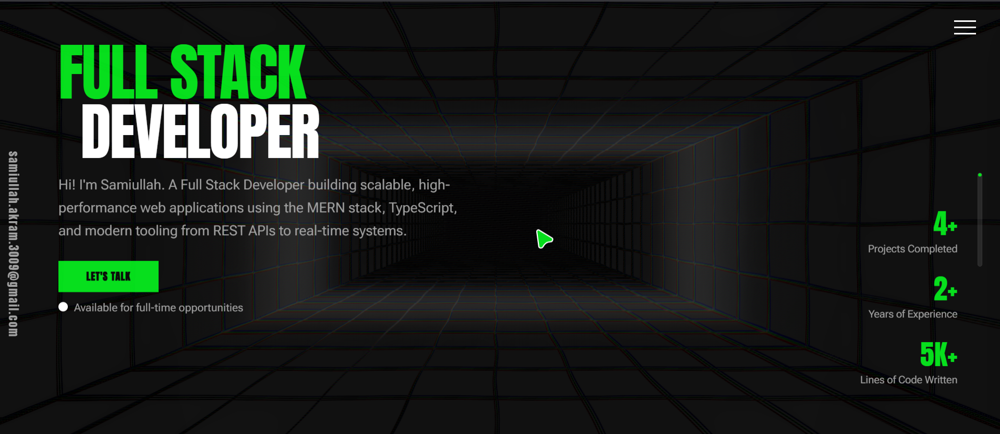

<div align="center">

# 🧑‍💻 Samiullah — Full Stack Developer Portfolio

**A modern, animated portfolio built with React.js, GSAP, and Tailwind CSS.** Showcasing full stack SaaS products, AI-integrated systems, real-time applications, and a passion for clean, performant web development.

[](https://samiullah-portfolio-orpin.vercel.app/)
[](https://react.dev)
[](https://tailwindcss.com)
[](https://greensock.com/gsap)

</div>

---

## 📸 Preview

> *Home page with hero text, animated stats, and scroll-triggered transitions*



---

## ✨ Features

- 🎬 **Page transition curtain** — green wipe animation on every project page load
- 🖱️ **Custom Interactive Cursor** — high-performance, responsive custom pointer that reacts to clickable elements
- 📈 **Scroll Progress Indicator** — top fixed progress bar tracing scroll depth
- 🖼️ **Cursor-following image previews** — hover a project name to see a live screenshot float beside your cursor
- 📜 **Scroll-triggered animations** — elements slide in and out as you scroll using GSAP ScrollTrigger
- 🌐 **GridScan background** — interactive animated grid that reacts to mouse movement
- 📧 **Sticky email bar** — vertical email link fixed to the left on every page
- 🍔 **Slide-in nav drawer** — hamburger menu with social links and page navigation
- 📱 **Fully responsive** — mobile-first layout with desktop enhancements
- ⚡ **Preloader animation** — branded intro before the main content loads
- 🧩 **Multi-page SPA** — React Router with dedicated pages for each project
- 🗂️ **All Projects page** — dedicated page listing all 10 projects with hover previews

---

## 🚀 Live Demo

**[→ View Portfolio](https://samiullah-portfolio-orpin.vercel.app/)**

---

## 🗂️ Project Structure

```text
Portfolio/
│
├── public/
│   └── favicon.svg
│
├── src/
│   ├── assets/
│   │   └── components/
│   │       ├── Preloader.jsx               # Intro loading animation
│   │       └── ScrollProgressIndicator.jsx # Fixed top scroll depth bar
│   │
│   ├── components/
│   │   ├── Home.jsx                    # Hero section with stats
│   │   ├── Aboutme.jsx                 # About me section
│   │   ├── MyStack.jsx                 # Tech stack display
│   │   ├── Projects.jsx                # Project list with hover previews
│   │   ├── AllProjects.jsx             # All projects page (/all-projects)
│   │   ├── Contact.jsx                 # Contact / CTA section
│   │   └── Emailbar.jsx                # Fixed vertical email bar
│   │
│   ├── Cursor/
│   │   └── CustomCursor.jsx            # Interactive custom mouse pointer
│   │
│   ├── projects/
│   │   ├── images/
│   │   │   ├── ChatSpark.png           # ChatSpark AI screenshot
│   │   │   ├── BillMate.png            # BillMate screenshot
│   │   │   ├── ResumeForge.png         # ResumeForge AI screenshot
│   │   │   ├── MovieBrowser.png        # Movie Browser screenshot
│   │   │   ├── StoweWeb.png            # Stowe screenshot
│   │   │   ├── Onyxchess.png           # OnyxChess screenshot
│   │   │   ├── Livepin.png             # LivePin screenshot
│   │   │   ├── PasteWeb.png            # Paste App screenshot
│   │   │   ├── CryptoWeb.png           # Crypto Tracker screenshot
│   │   │   └── SkycastWeb.png          # Skycast Weather screenshot
│   │   ├── ChatSpark.jsx               # ChatSpark AI project page
│   │   ├── BillMate.jsx                # BillMate project page
│   │   ├── ResumeForge.jsx             # ResumeForge AI project page
│   │   ├── MovieBrowser.jsx            # Movie Browser project page
│   │   ├── Stowe.jsx                   # Stowe project page
│   │   ├── OnyxChess.jsx               # OnyxChess project page
│   │   ├── LivePin.jsx                 # LivePin project page
│   │   ├── Pasteapp.jsx                # Paste App project page
│   │   ├── Cryptotracker.jsx           # Crypto Tracker project page
│   │   └── Skycast.jsx                 # Skycast project page
│   │
│   ├── GridScan.jsx                    # Interactive animated background
│   ├── App.jsx                         # Router and layout setup
│   └── main.jsx                        # App entry point
│
├── index.html
├── tailwind.config.js
├── vercel.json                         # Vercel deployment config
├── vite.config.js
└── README.md
```

---

## 🏁 Getting Started

```bash
# 1. Clone the repository
git clone https://github.com/Samiullah-2004/portfolio.git

# 2. Navigate into the project
cd portfolio

# 3. Install dependencies
npm install

# 4. Start the development server
npm run dev
```

Then open [http://localhost:5173](http://localhost:5173) in your browser.

---

## 🚢 Deployment

This site is deployed on **Vercel**.

```bash
# Build for production
npm run build

# Preview production build locally
npm run preview
```

To deploy, push to your GitHub repo and connect it to [Vercel](https://vercel.com) — it auto-deploys on every push to `main`.

---

## 👤 Author

**Samiullah Akram**
Full Stack Developer - React, Next.js, Node.js, AI/RAG from Lahore, Pakistan 🇵🇰

[](https://github.com/Samiullah-2004)
[](https://www.linkedin.com/in/samiullah-akram-a28461404/)
[](https://www.upwork.com/freelancers/~01ffa5cf678d8eff63)
[](mailto:samiullah.akram.3009@gmail.com)

---

## 📄 License

This project is open source and free to use for personal and educational purposes.
If you use this as a reference or template, a credit would be appreciated! 🙏

---

## 🛠️ Tech Stack

| Technology | Purpose |
|---|---|
| **React.js** | UI components and SPA architecture |
| **React Router v6** | Client-side page routing |
| **GSAP + ScrollTrigger** | Scroll animations and page transitions |
| **@gsap/react** | useGSAP hook for React integration |
| **Tailwind CSS** | Utility-first styling and responsiveness |
| **TypeScript** | Type-safe development across projects |
| **Next.js** | Full stack React framework |
| **Vite** | Lightning-fast build tool and dev server |

---

## 📦 Projects Featured

### 🤖 ChatSpark AI
An AI chatbot SaaS where users upload documents, create custom chatbots trained on their content, and embed them on any website with a single script tag. Built on a full RAG pipeline: PDF extraction, vector embeddings via Hugging Face, pgvector similarity search, and live LLM inference via Groq (Llama 3.3). Multi-tenant architecture with per-user data isolation and NextAuth.js v5 authentication.
**Stack:** Next.js · TypeScript · PostgreSQL · Prisma · pgvector · Hugging Face · Groq · NextAuth.js · Vercel

### 🧾 BillMate
A full-stack invoicing SaaS built for freelancers. Handles client management, invoice creation with auto-numbering, payment status tracking, and a live earnings dashboard. REST API built with Express and TypeScript following MVC architecture, Prisma ORM on PostgreSQL, and a clean React frontend deployed on Vercel.
**Stack:** Node.js · Express · TypeScript · PostgreSQL · Prisma · React · Tailwind CSS · Vercel & Railway

### 📝 ResumeForge AI
An AI-powered resume tailoring platform that analyzes job descriptions and rewrites resumes to match using live LLM inference via Groq. Built end-to-end with Next.js and TypeScript, from PostgreSQL database schema to deployment, with JWT-based authentication and per-user resume history.
**Stack:** Next.js · TypeScript · PostgreSQL · Prisma · Groq (Llama 3.3) · JWT · Vercel

### 🎬 Movie Browser
A full-featured movie discovery app built as a capstone project during an internship at Qwetrum Technologies. Connects to the TMDB API for real-time movie data, features custom React hooks, debounced search, genre filtering, and a dark/light theme toggle persisted via localStorage.
**Stack:** React · JavaScript · Tailwind CSS · TMDB API · Vercel

### 🛍️ Stowe
A full-featured e-commerce platform built end-to-end with the MERN stack. Handles product listings, image uploads, JWT authentication, role-based admin dashboard, and a complete order flow with live stock validation — deployed on Railway with MongoDB Atlas.
**Stack:** MongoDB · Express · Node.js · EJS · JWT · bcrypt · Multer · Tailwind CSS · Railway

### ♟️ OnyxChess
A real-time multiplayer chess app where two players share a room and play live. Features drag-and-drop and click-to-move, automatic board flip for the black player, full move validation, and instant sync via Socket.IO WebSockets.
**Stack:** Node.js · Express · Socket.IO · chess.js · EJS · Tailwind CSS

### 📍 LivePin
A real-time multi-user location tracker that renders every connected user's live position on an interactive map. Markers update instantly as users move and disappear the moment someone disconnects.
**Stack:** Node.js · Express · Socket.IO · Leaflet.js · EJS

### 📋 Paste App
A multi-functional paste manager with Redux state management, real-time search, and clipboard actions.
**Stack:** React · Redux Toolkit · Tailwind CSS · Vercel

### 📈 Crypto Tracker
Live cryptocurrency price tracker powered by the Binance WebSocket API.
**Stack:** JavaScript · CSS · Binance API

### 🌤️ Skycast Weather
Clean weather app with location-based forecasts using the OpenWeather API.
**Stack:** JavaScript · CSS · OpenWeather API

---

<div align="center">

**Built with 💚 by Samiullah — 2026**

</div>